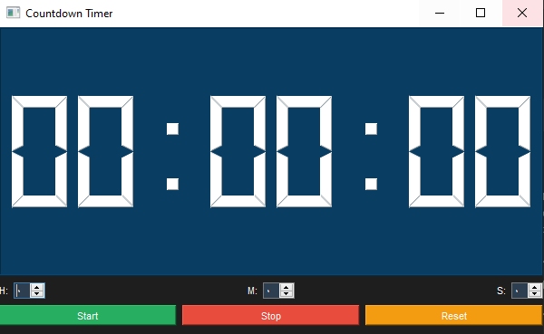

# 🕒 Countdown Timer

A PyQt5-based countdown timer application with modern UI



## Features
- Set hours, minutes, seconds
- Start/Stop/Reset controls
- LCD-style display
- Dark mode interface

## Installation
```bash
pip install -r requirements.txt
python lcd.py